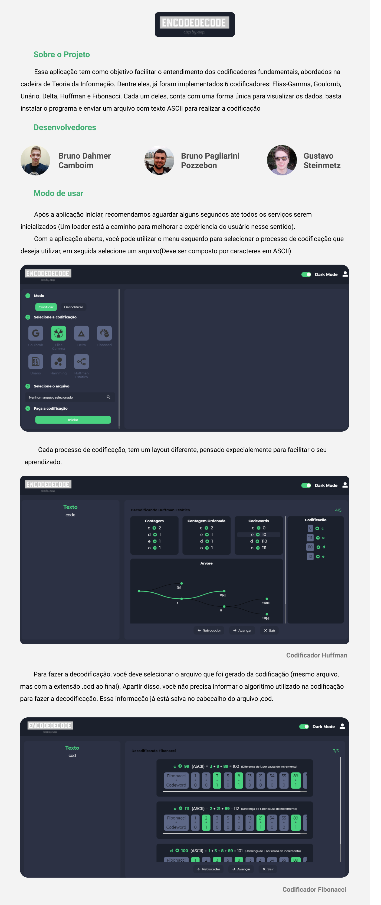

## O Programa
Esse projeto foi desenvolvido com o intuito de realizar codificações de arquivos em nivel bitwise.
Abrangendo seis algoritmos de codificação: delta, unário, elias-gamma, fibonacci, goulomb e huffman estático.
Além disso, criamos uma interface gráfica para facilitar a vizualização.

## Observações Importantes
1. A codificação Unária pode demorar uma eternidade, dependendo da entrada que lhe for dada, por isso fique tranquilo,
espere alguns minutos e terá o resultado dela.

## Dependência
1. Java 8.+

## Instalação
# Método 1 Clonando esse repositório
1. Clone o repositório
2. cd ./EncodeDecodeStepByStep/frontend
3. yarn ou npm install (Escolha o da sua prefêrencia)
4. yarn run build
5. Instale a distribuição gerada em EncodeDecodeStepByStep/frontend/dist
3. Execute o main em src/main/java/controllers/CodificationGUI, isso abre uma interface gráfica

# Método 2 Usando as releases disponiveis nesse Github
1. Atualmente está disponível a realease para windows 64x

## Desenvolvedores
1. <a href="https://www.linkedin.com/in/bruno-camboim3b6/" target="_blank">Bruno Camboim</a>
2. <a href="https://www.linkedin.com/in/bruno-pozzebon44/" target="_blank">Bruno Pozzebon</a>
3. <a href="https://www.linkedin.com/in/stzgustavo/" target="_blank">Gustavo Steinmetz</a>

