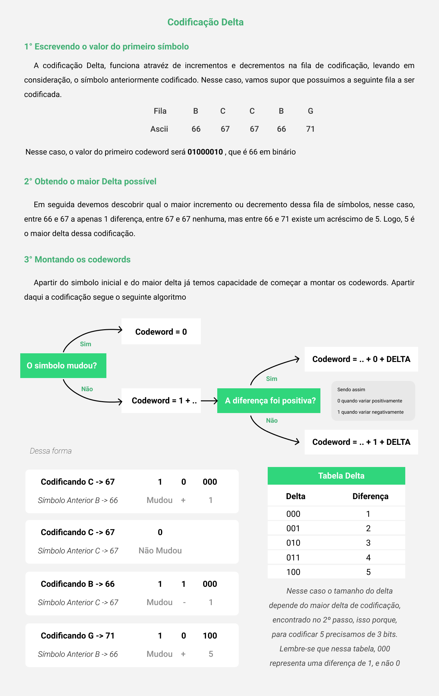
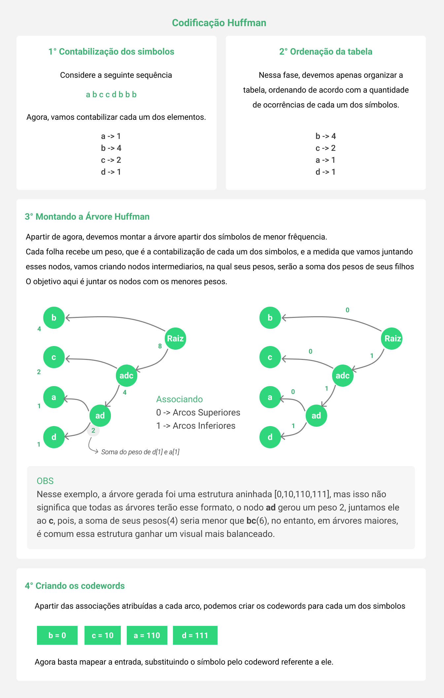

# Encode Decode Step by Step
[](/README.md)
[](/README.pt-br.md)

This project was developed with the purpose of performing bitwise file encodings.
Covering six encoding algorithms: delta, unary, elias-gamma, fibonacci, goulomb, and static huffman.
In addition, we created a graphical interface to facilitate visualization.

## Requirements ⚠
1. [Java 8+](https://www.oracle.com/java/technologies/javase-jdk11-downloads.html)
2. [Node.js 12.18+](https://nodejs.org/en/)


## Installation 💾
### Method 1 Using the [releases](https://github.com/EncodeDecodeStepByStep/EncodeDecodeStepByStep/releases) available on this Github
#### Windows


#### Linux
1. Download the .zip file for Linux
2. Unzip the content and enter the extracted folder
3. Run the EncodeDecode.AppImage file, or in the terminal, execute the command ./encode-decode-step-by-step

> Note: In the Linux world, certain inconveniences may occur during the step-by-step display process. Avoid encoding or decoding a certain file, in which its path is in a folder with spaces or accents. In certain distributions, this generates errors, which are still being resolved.

### Method 2 Cloning this repository
1. Clone the repository
```
git clone https://github.com/EncodeDecodeStepByStep/EncodeDecodeStepByStep.git
```
2. Navigate to the frontend folder
```
cd EncodeDecodeStepByStep/frontend
```
3. Install dependencies
```
npm install
```
4. Build the application
```
npm run build
```
5. Install the distribution generated in EncodeDecodeStepByStep/frontend/dist
   

6. Oh, and don't forget to star 🌟 the repository, then it will work on the first try 😁

## How to use the application? 🤔


## Developers 😎
1. <a href="https://www.linkedin.com/in/bruno-camboim3b6/" target="_blank">Bruno Camboim</a>
2. <a href="https://www.linkedin.com/in/bruno-pozzebon44/" target="_blank">Bruno Pozzebon</a>
3. <a href="https://www.linkedin.com/in/stzgustavo/" target="_blank">Gustavo Steinmetz</a>








