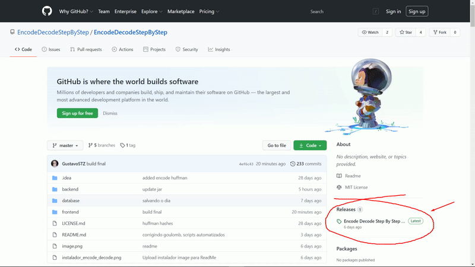
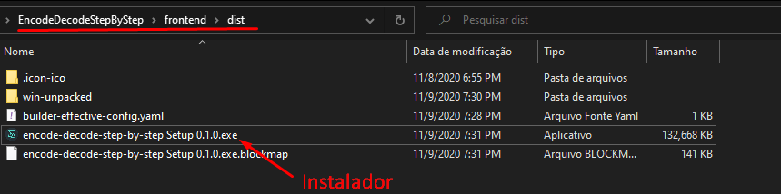
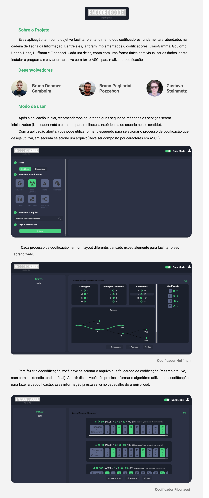
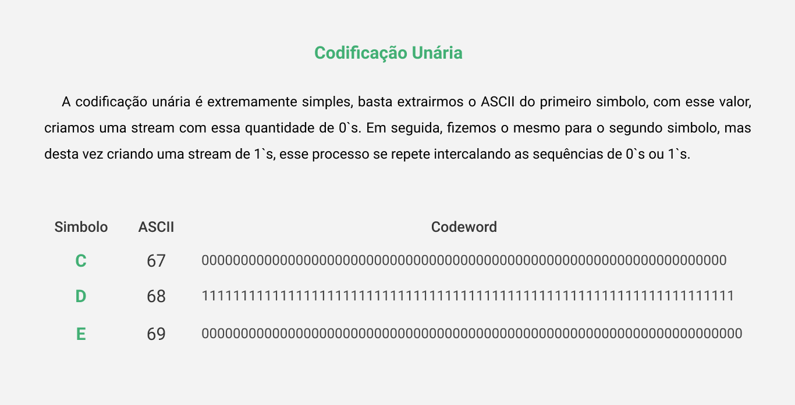
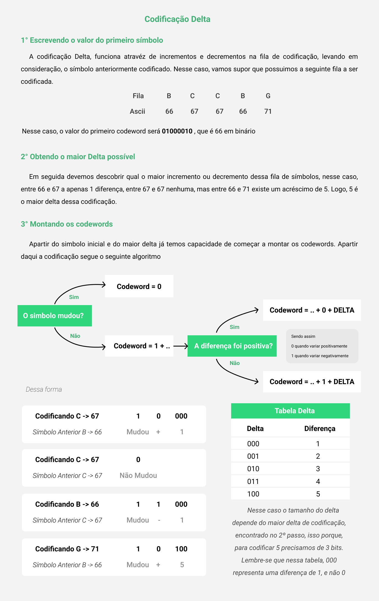
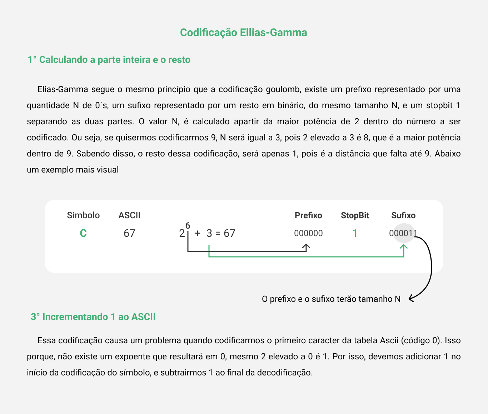
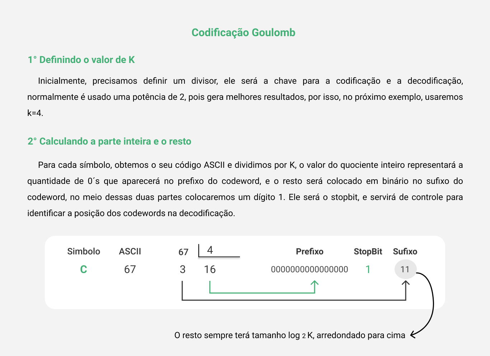
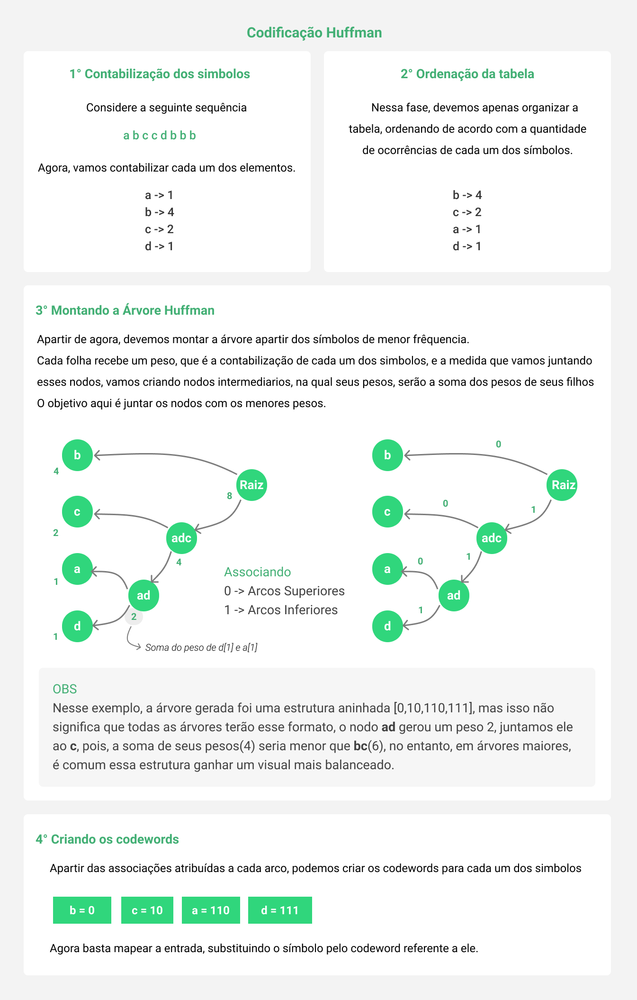
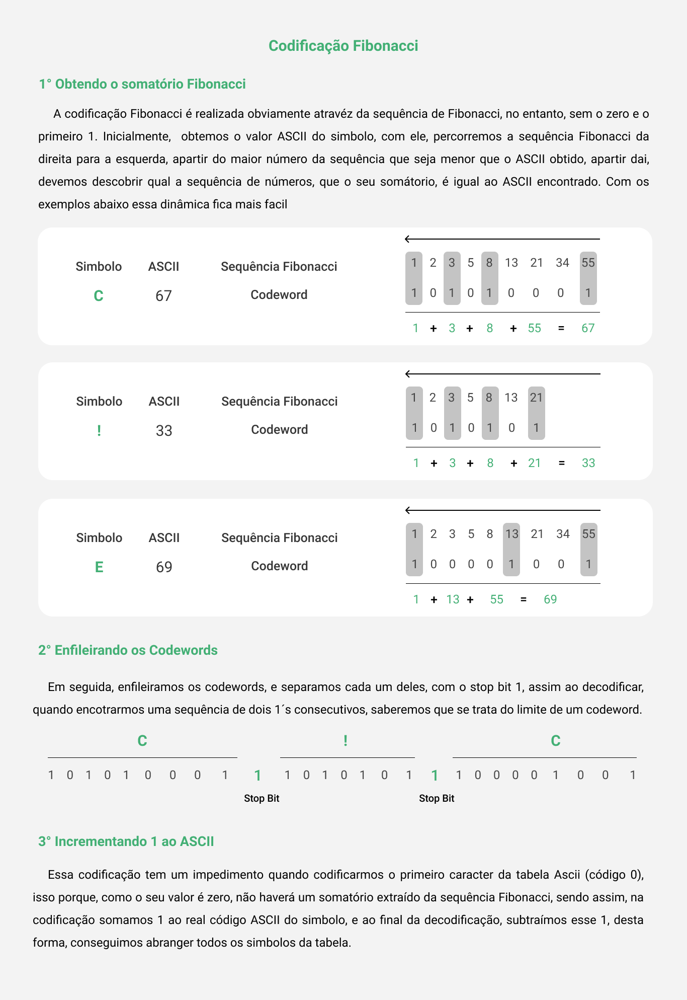

# Encode Decode Step By Step
Esse projeto foi desenvolvido com o intuito de realizar codificações de arquivos em nível bitwise.
Abrangendo seis algoritmos de codificação: delta, unário, elias-gamma, fibonacci, goulomb e huffman estático.
Além disso, criamos uma interface gráfica para facilitar a vizualização.

## Requisitos ⚠
1. [Java 8+](https://www.oracle.com/java/technologies/javase-jdk11-downloads.html)
2. [Node.js 12.18+](https://nodejs.org/en/)


## Instalação 💾
### Método 1 Usando as [releases](https://github.com/EncodeDecodeStepByStep/EncodeDecodeStepByStep/releases) disponiveis nesse Github
#### Windows



#### Linux
1. Baixa o arquivo .zip para linux
2. Descompacte o conteúdo, e entre na pasta extraída
3. Execute o arquivo EncodeDecode.AppImage ou, por terminal execute o comando ./encode-decode-step-by-step

> Obs: No mundo linux, poderá acontecer certos inconvenientes durante o processo de exibição do passo-a-passo. Evite codificar ou decodificar um certo arquivo, na qual o seu path, esteja em uma pasta com espaços ou acentos. Em certas distribuições, isso gera erros, que ainda estão sendo resolvidos.

### Método 2 Clonando esse repositório
1. Clone o repositório
```
git clone https://github.com/EncodeDecodeStepByStep/EncodeDecodeStepByStep.git
```
2. Navegue até a past frontend
```
cd EncodeDecodeStepByStep/frontend
```
3. Instalar dependencias
```
npm install
```
4. Builde a aplicação
```
npm run build
```
5. Instale a distribuição gerada em EncodeDecodeStepByStep/frontend/dist


6. Ah e não esqueça de deixar a estrelinha 🌟 no repositório que dae vai funcionar de primeira 😁

## Como usar a aplicação? 🤔


## Desenvolvedores 😎
1. <a href="https://www.linkedin.com/in/bruno-camboim3b6/" target="_blank">Bruno Camboim</a>
2. <a href="https://www.linkedin.com/in/bruno-pozzebon44/" target="_blank">Bruno Pozzebon</a>
3. <a href="https://www.linkedin.com/in/stzgustavo/" target="_blank">Gustavo Steinmetz</a>








